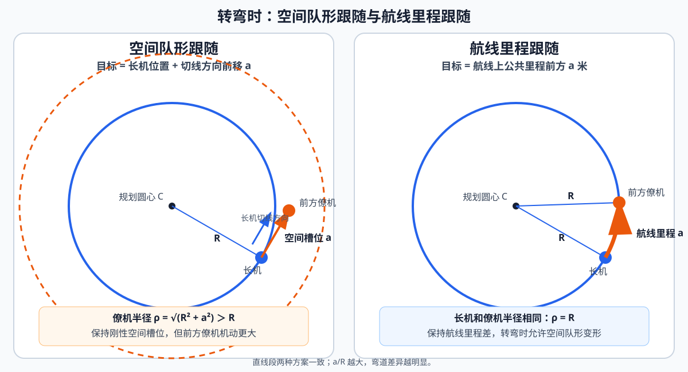
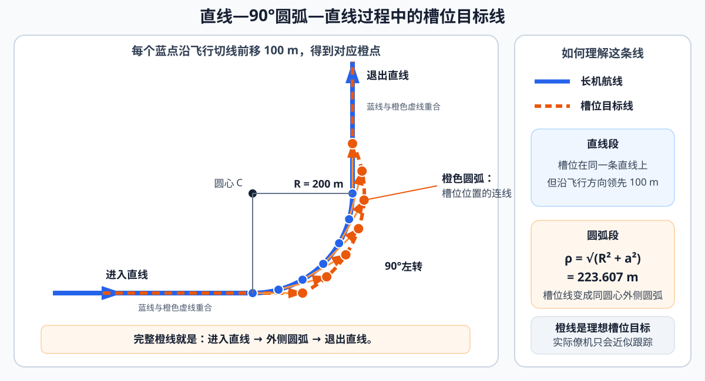
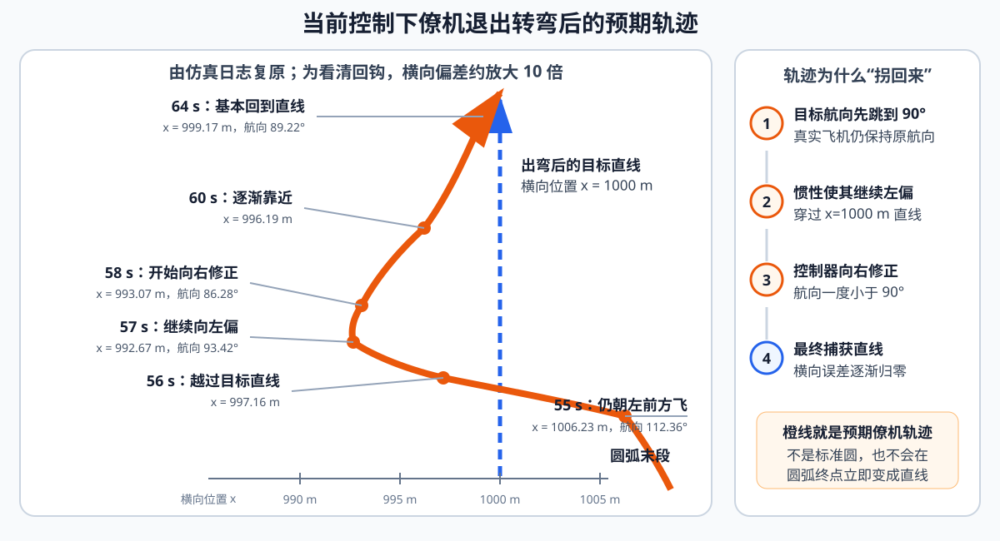
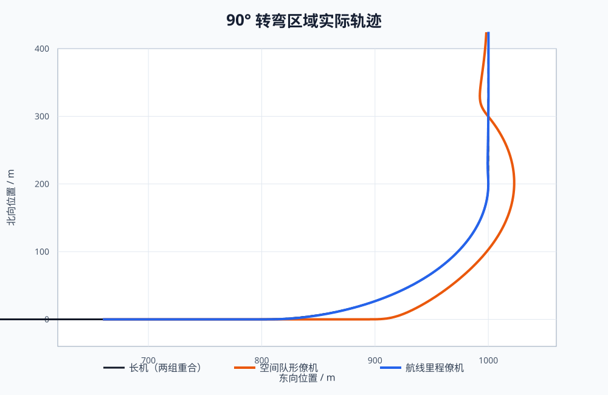
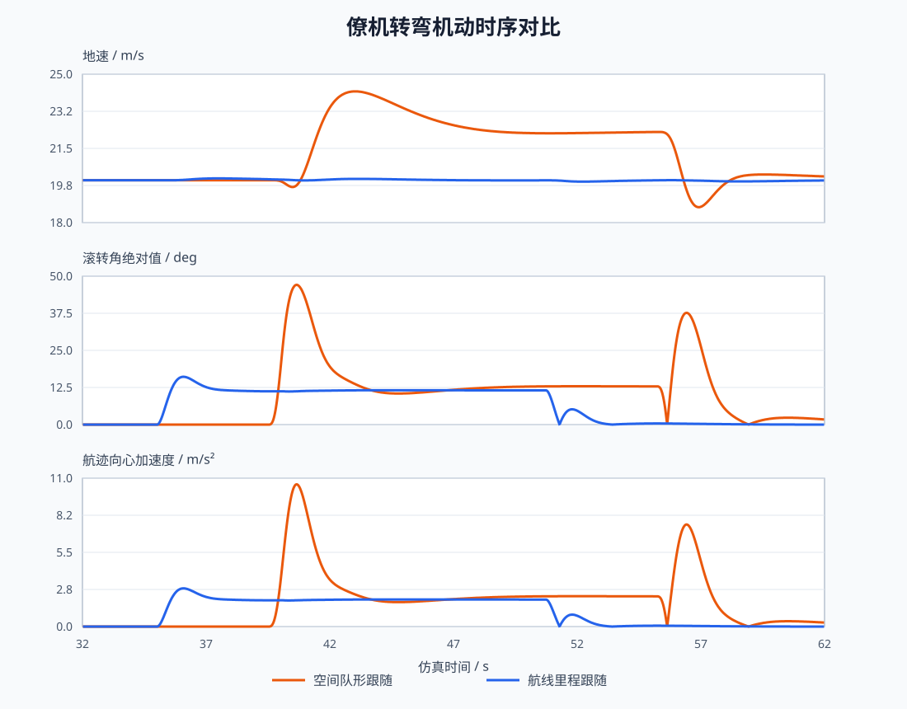

# 空间队形跟随与航线里程跟随对比验证报告

> 报告日期：2026-08-13
> 验证对象：一字纵队中位于长机前方 100 m 的僚机
> 验证场景：20 m/s、半径 200 m 的 90°左转

## 1. 结论

两种方案解决的是不同问题：

- **空间队形跟随**要求僚机始终位于长机航迹切线前方 100 m，优先保持刚性空间槽位。
- **航线里程跟随**要求僚机位于公共规划航线前方 100 m，优先保持航线和里程间隔。

空间队形方案有两类影响：

1. **稳态影响**：转弯中的槽位目标变为半径更大的外侧圆弧。本算例半径、目标速度和向心加速度理论上均增加 **11.8%**。
2. **动态影响**：外侧圆弧与前后直线不相切，目标航向在进入和退出圆弧时各跳变 **26.6°**，引起大滚转、大侧向加速度、跟踪超调和退出回钩。

仿真中，空间队形方案的峰值滚转角为 **47.07°**、峰值向心加速度为 **10.542 m/s²**；航线里程方案分别为 **16.10°** 和 **2.830 m/s²**。大峰值主要来自动态不连续，而不是外侧圆弧的稳态负担。

如果任务要求各机沿规划航线平滑通过转弯，建议采用**航线里程跟随**；只有在任务必须严格保持瞬时空间构型时，才优先采用空间队形跟随，并对直线—圆弧交接进行专门平滑处理。

## 2. 两种方案

设规划航线为：

$$
\mathbf p=\gamma(s)
$$

其中 $s$ 为航线累计里程，$a=100$ m 为僚机前向间隔。

空间队形目标为：

$$
\mathbf q_{\mathrm{space}}=\mathbf p_L+a\mathbf t_L
$$

即从长机实际位置沿瞬时航迹切线前移 100 m。

航线里程目标为：

$$
\mathbf q_{\mathrm{route}}=\gamma(s_{\mathrm{ref}}+a)
$$

即沿公共规划航线前进 100 m。

实现中，$s_{\mathrm{ref}}$ 由长机实际位置在公共航线上的投影得到，只提取一维里程，不把长机横向误差平移给僚机。里程跨航段保持单调连续，航线起点前和终点后按端点切线延拓；直接 HOLD 或运行期切换队形时，在航线前、上、右坐标系中分别用 TD 平滑槽位分量，避免位置目标阶跃，并确保前向与侧向过渡各自服从对应的控制权限。



直线飞行时两种定义基本一致；转弯时，“切线上前方 100 m”与“航线上前方 100 m”不再是同一个点。

## 3. 影响分析

### 3.1 稳态影响：外侧半径和持续机动负担

长机以半径 $R$ 转弯时，空间槽位目标到圆心的距离为：

$$
\rho_{\mathrm{space}}=\sqrt{R^2+a^2}
$$

若保持与长机相同的角速度 $\omega=V/R$，则：

$$
V_{\mathrm{space}}=\omega\rho_{\mathrm{space}}
$$

$$
A_{\mathrm{space}}=\omega^2\rho_{\mathrm{space}}
$$

因此，半径、目标速度和向心加速度相对长机的放大倍数相同：

$$
\frac{\rho_{\mathrm{space}}}{R}
=
\frac{V_{\mathrm{space}}}{V}
=
\frac{A_{\mathrm{space}}}{V^2/R}
=
\sqrt{1+\left(\frac aR\right)^2}
$$

当前 $R=200$ m、$a=100$ m、$V=20$ m/s，理论稳态结果为：

| 指标 | 空间队形跟随 | 航线里程跟随 |
| --- | ---: | ---: |
| 转弯半径 | 223.607 m | 200.000 m |
| 目标速度 | 22.361 m/s | 20.000 m/s |
| 向心加速度 | 2.236 m/s² | 2.000 m/s² |
| 协调转弯滚转角 | 12.845° | 11.527° |

空间方案的稳态机动负担增加约 **11.8%**。航线方案保持规划半径和规划速度，不产生这一额外放大。

### 3.2 动态影响：交接处航向不连续

长机规划航线的圆弧与直线相切，因此长机目标位置和航向连续；但其曲率从直线的 0 突变为圆弧的 $1/R$。

空间槽位目标为：

$$
\mathbf q(s)=\gamma(s)+a\mathbf t(s)
$$

对航线里程求导：

$$
\mathbf q'(s)=\mathbf t(s)+a\kappa(s)\mathbf n(s)
$$

直线段和圆弧段分别为：

$$
\mathbf q'_{\mathrm{line}}=\mathbf t
$$

$$
\mathbf q'_{\mathrm{arc}}=\mathbf t+\frac aR\mathbf n
$$

因此，长机航线的曲率突变经过空间槽位变换后，变成僚机目标路径的航向跳变：

$$
\Delta\psi=\arctan\left(\frac aR\right)
$$

当前 $a/R=0.5$：

$$
\Delta\psi=26.565^\circ
$$

目标速度向量的突变量为：

$$
\lvert\Delta\mathbf v\rvert=a\omega=10\ \mathrm{m/s}
$$



图中蓝线是长机的“进入直线—90°圆弧—退出直线”航线。每个蓝点沿飞行切线前移 100 m 得到橙点，连续橙点构成槽位目标线。直线段内蓝线与橙线位于同一直线上；圆弧段内橙线变成外侧圆弧，并且与前后直线不相切。

理想飞机若要以非零速度瞬间改变 26.6°航向，需要无限大的瞬时角速度和横向加速度。真实飞机无法实现，只能快速滚转、穿过目标直线，再反向修正并重新捕获，因此出现退出回钩。



航线里程方案直接沿规划航线取点，保留圆弧与直线的切向连续性。其曲率仍会从 $1/R$ 变为 0，因此向心加速度存在阶跃，但不会出现 26.6°的目标航向跳变。

### 3.3 参数影响

两个无量纲参数足以概括主要趋势：

| 参数 | 含义 | 对空间队形方案的影响 |
| --- | --- | --- |
| $a/R$ | 槽位长度相对转弯半径 | 决定稳态放大倍数 $\sqrt{1+(a/R)^2}$ 和动态航向跳变 $\arctan(a/R)$ |
| $V^2/(gR)$ | 基础转弯负荷 | 决定当前转弯本身需要的滚转和载荷水平 |

$a/R$ 越大，外侧半径和交接航向跳变越大；$V^2/(gR)$ 越大，飞机消化同一航向跳变所需的机动余量越紧张。

## 4. 仿真验证

### 4.1 验证设置

两组试验使用同一场景配置，只替换 `FOLLOWER_PROFILE` 在编队飞行阶段选择的 `pos_calc` 策略，其余条件保持一致：

| 项目 | 设置 |
| --- | --- |
| 空间队形方案 | 对比脚本临时 Profile / `SLOT_GEOMETRY` |
| 航线里程方案 | 正式 `FOLLOWER_PROFILE` / `ROUTE_FORMATION` |
| 位置控制器 | 两组均为 `PID_POSITION` |
| 航线 | 直线—半径 200 m 的90°左转—直线 |
| 编队 | 长机 L01；前方僚机 F01，间隔100 m |
| 速度、步长、时长 | 20 m/s、0.02 s、70 s |
| 通信和环境 | 0 ms时延、0丢包、`seed=0` |

两组仿真快照各有3500帧，长机位置和速度逐帧最大差值为0，因此僚机差异可归因于目标点生成方式。

### 4.2 稳态结果

共同圆弧窗口为40.0～50.7 s：

| 指标 | 空间队形跟随 | 航线里程跟随 |
| --- | ---: | ---: |
| 实际平均转弯半径 | 224.305 m | 199.937 m |
| 相对规划圆平均偏差 | 24.305 m | 0.063 m |
| 实际航线里程间隔 | 91.212 m | 99.493 m |
| 刚性切线槽位误差 | 2.786 m | 24.732 m |
| 全程最小两机距离 | 97.601 m | 98.412 m |

空间方案的实际半径与理论外侧半径223.607 m接近，说明稳态分析有效。航线方案基本贴合规划圆并保持100 m里程间隔，但不再保持严格切线空间槽位。

### 4.3 动态结果





| 指标 | 空间队形跟随 | 航线里程跟随 |
| --- | ---: | ---: |
| 机动持续时间 | 21.62 s | 17.30 s |
| 峰值地速 | 24.189 m/s | 20.084 m/s |
| 峰值向心加速度 | 10.542 m/s² | 2.830 m/s² |
| 峰值滚转角绝对值 | 47.069° | 16.099° |
| 目标跟踪误差 RMS | 3.453 m | 0.332 m |
| 目标跟踪误差峰值 | 7.437 m | 1.897 m |

空间方案的稳态理论滚转角只有12.845°，但动态峰值达到47.069°；向心加速度也从理论2.236 m/s²上升到10.542 m/s²。这说明大峰值主要来自直线与外侧圆弧不相切造成的动态响应。

航线方案仍有曲率切换瞬态，但不存在目标航向跳变，因此峰值明显更低。

## 5. 方案取舍

| 任务关注点 | 推荐方案 | 代价 |
| --- | --- | --- |
| 严格保持长机航迹系中的空间构型 | 空间队形跟随 | 外侧半径增大，交接处存在航向不连续 |
| 各机沿规划航线平滑转弯 | 航线里程跟随 | 转弯中不保持严格切线空间槽位 |
| 大前向间隔或小转弯半径 | 航线里程跟随 | 需要可靠的公共航线进度 |
| 直线巡航 | 两种方案均可 | 几何差异很小 |

两种算法仍是 `pos_calc` 产品，正式僚机 Profile 已按本次选型配置为航线里程跟随：

```text
SLOT_GEOMETRY   —— 空间队形跟随
ROUTE_FORMATION —— 航线里程跟随（FOLLOWER_PROFILE 当前配置）
```

若必须采用空间队形方案，应在规划航线中加入曲率连续的缓和转弯，或对槽位目标速度进行过渡处理。否则无法同时保证严格刚性槽位、突变曲率航线和目标航向连续。

## 6. 结论边界与复现

本报告只验证一架前方僚机、100 m纵向槽位、半径200 m和速度20 m/s的90°左转，未覆盖横向槽位、后方槽位、风、时延和丢包。

试验输入：

- [`data/航线里程跟随.json`](data/航线里程跟随.json)
- [`data/纵队_前方100米.json`](data/纵队_前方100米.json)

分析脚本会从正式 `FOLLOWER_PROFILE` 复制一份临时 Profile，只把编队飞行阶段的位置解算策略改为 `SLOT_GEOMETRY`，随后用同一配置和随机种子依次运行两种方案。临时 Profile 仅在脚本进程内生效，不修改正式运行配置，也不依赖未入库的原始日志。

汇总指标：[`assets/metrics.json`](assets/metrics.json)

重新生成指标和图表：

```powershell
.\.venv\Scripts\python.exe -X utf8 scripts/analyze_following_schemes.py `
  --config "docs/编队跟随方案对比/data/航线里程跟随.json" `
  --output-dir "docs/编队跟随方案对比/assets"
```
