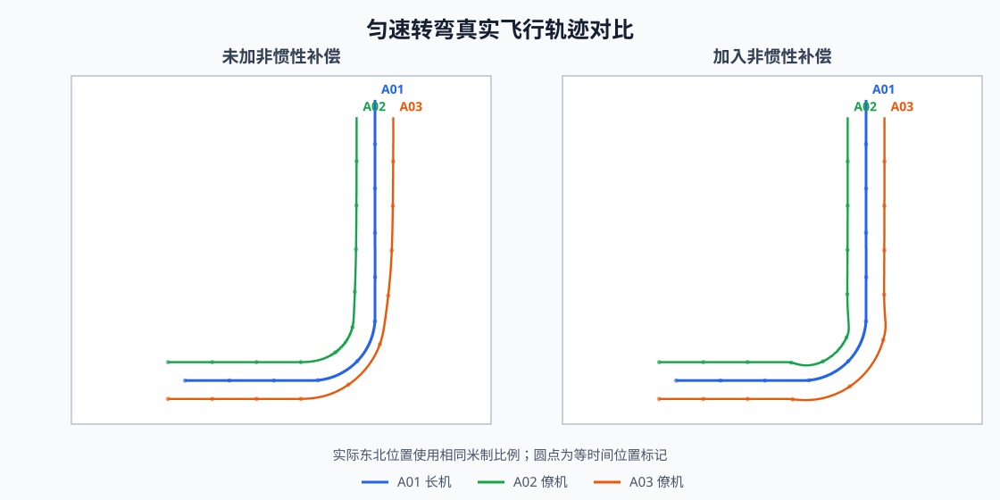
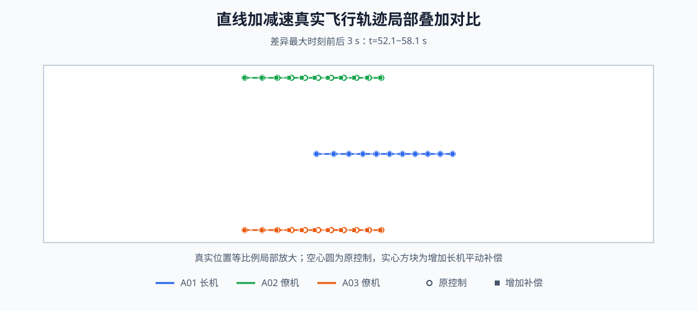
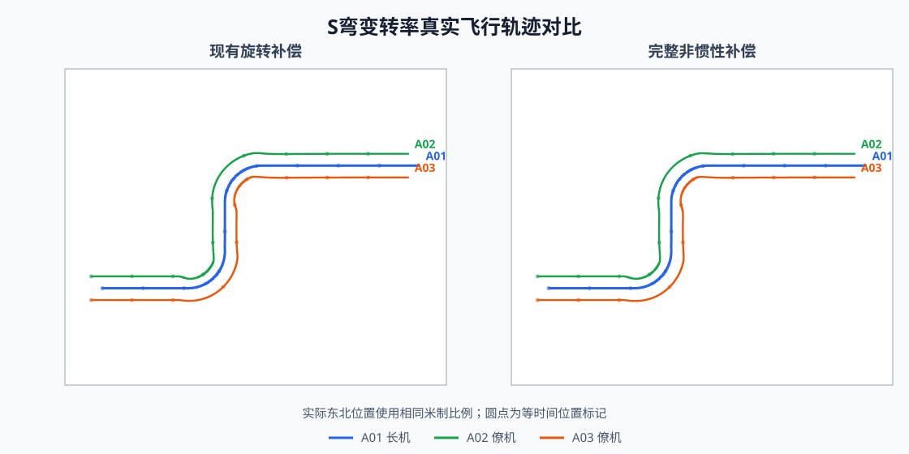
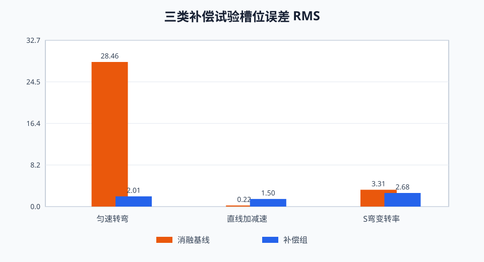

# 非惯性补偿分析与仿真验证报告

> 日期：2026-08-06
> 目的：分析不同飞行场景需要哪些非惯性补偿，并通过仿真验证补偿效果

## 1. 理论分析

### 1.1 基本原理

僚机保持的目标不是固定地理点，而是一个随长机平移和转动的编队槽位。设长机位置为 $p_L$，僚机相对长机的槽位为 $r$，编队转动角速度为 $\omega$，则槽位目标运动满足：

$$
p_i=p_L+r
$$

$$
v_i=v_L+\omega\times r
$$

$$
a_i=a_L+\dot{\omega}\times r+\omega\times(\omega\times r)
$$

式中：

- $\omega\times r$：槽位随编队转动产生的运输速度；
- $a_L$：长机加速或减速产生的平动加速度；
- $\dot{\omega}\times r$：转弯角速度变化产生的角加速度；
- $\omega\times(\omega\times r)$：稳定转弯时槽位所需的向心加速度。

### 1.2 不同场景需要的补偿

| 飞行场景 | 主要运动特点 | 理论上需要关注的补偿 |
| --- | --- | --- |
| 匀速直线 | 长机不加速，编队不转动 | 不需要额外非惯性补偿 |
| 匀速转弯 | $\omega$ 不为零且基本稳定 | 旋转运输速度和向心加速度补偿 |
| 直线加减速 | $a_L$ 不为零，$\omega=0$ | 长机平动加速度补偿 |
| 开始/退出转弯、S 弯 | $\omega$ 随时间变化 | 角加速度补偿，同时保留转弯向心补偿 |

从理论公式看，不同场景应使用对应补偿项。但补偿能否直接加入现有控制器，还要通过仿真判断，因为控制器本身可能已经通过速度指令和反馈环间接实现了部分作用。

## 2. 仿真验证

### 2.1 公共条件

三组仿真均使用一架长机和两架僚机，仿真步长为 `0.02 s`，通信时延和丢包均为零。每组只改变待验证的控制策略，长机航迹、飞机模型、初始状态和反馈参数保持一致。

槽位误差采用三维位置误差：

$$
e=\sqrt{e_E^2+e_N^2+e_H^2}
$$

### 2.2 匀速转弯试验

**场景**：长机以 `20 m/s` 飞行，通过半径 `200 m` 的 90° 转弯。

**对比**：

- 无补偿：关闭槽位旋转运输速度和转弯向心前馈；
- 有补偿：加入槽位旋转运输速度和转弯向心前馈。

| 指标 | 无补偿 | 有补偿 |
| --- | ---: | ---: |
| 槽位误差 RMS | 28.459 m | 2.013 m |
| 槽位误差峰值 | 41.105 m | 5.183 m |



图中曲线直接取自仿真输出的飞机实际位置。左、右两幅图使用相同坐标范围和米制比例：左图关闭非惯性补偿，右图加入旋转运输速度和向心加速度补偿。加入补偿后，两架僚机在转弯过程中能够更稳定地维持相对长机的编队位置。

加入补偿后，槽位误差 RMS 降低 **92.9%**。无补偿时，僚机只能追逐不断转动的目标槽位，形成明显滞后；加入运输速度和向心加速度后，僚机能够提前执行转弯所需机动。

**结果**：匀速转弯必须保留旋转运输速度和向心加速度补偿。

### 2.3 直线加减速试验

**场景**：长机沿直线执行 `15→25→15 m/s` 的加速和减速过程。

**对比**：

- 原控制：使用现有速度指令和反馈控制；
- 增加平动补偿：在原控制基础上额外叠加长机加速度 $a_L$。

| 指标 | 原控制 | 增加 $a_L$ |
| --- | ---: | ---: |
| 槽位误差 RMS | 0.217 m | 1.496 m |
| 槽位误差峰值 | 0.322 m | 2.843 m |
| 水平加速度峰值 | 6.000 m/s² | 6.000 m/s² |



两组实际轨迹叠加在同一坐标图中，并自动截取两组差异最大时刻前后各 3 秒进行等比例局部放大。空心圆表示原控制，实心方块表示增加 $a_L$ 后同一时刻的位置；对应标记的前后偏移就是重复补偿造成的真实位置差异。

结果表明，当前架构下直接加入 $a_L$ 不但没有改善误差，反而造成明显超调。原因是长机速度目标已经同步给僚机，僚机速度反馈环本身已经产生了跟随长机加减速所需的控制量；再次叠加 $a_L$ 会形成重复补偿。

**结果**：当前控制架构不应直接增加长机平动加速度补偿。以后若改变长机指令传递方式或重新设计前馈控制器，再重新验证该项。

### 2.4 S 弯变转率试验

**场景**：长机以 `20 m/s` 连续通过两个半径 `180 m`、方向相反的转弯，形成 S 弯。

**对比**：现有旋转补偿控制律与新增完整非惯性补偿控制律。两组都保留旋转运输速度和稳态向心补偿，完整补偿组同时加入长机平动与 $\dot{\omega}\times r$ 项。因此本试验只评价完整补偿组合，不单独归因其中某一项。

| 指标 | 现有旋转补偿 | 完整非惯性补偿 |
| --- | ---: | ---: |
| 槽位误差 RMS | 3.315 m | 2.677 m |
| 槽位误差峰值 | 6.562 m | 5.312 m |
| 水平加速度峰值 | 8.577 m/s² | 10.184 m/s² |



两幅图直接使用相同时间范围内的实际东北位置。使用完整补偿后，僚机在转率建立和反向过程中更及时地跟随长机轨迹，三机轨迹的相对关系更稳定。

使用完整非惯性补偿后，槽位误差 RMS 降低 **19.2%**，说明新增补偿组合能够改善开始转弯、退出转弯和反向转弯过程中的跟随效果。

完整策略已对前馈与反馈叠加后的总加速度执行限幅，水平加速度峰值为 `10.184 m/s²`。该值由受限的前向和侧向分量合成，仍高于现有旋转补偿组，但没有再出现未限幅时的异常尖峰。

**结果**：完整补偿组合在 S 弯中有效；当前三策略对比不能单独证明角加速度项的独立贡献。

### 2.5 结果对比



## 3. 结论

| 场景 | 建议使用的补偿 | 仿真结论 |
| --- | --- | --- |
| 匀速直线 | 不增加额外补偿 | 现有控制即可 |
| 匀速转弯 | 旋转运输速度和向心加速度补偿 | 效果明显，误差降低 92.9%，应保留 |
| 直线加减速 | 当前不直接叠加 $a_L$ | 与现有速度反馈重复，误差反而增大 |
| 开始/退出转弯、S 弯 | 完整非惯性补偿组合 | 误差降低 19.2%，控制代价有所增加 |

综合来看，非惯性补偿不是补偿项越多越好，而是要根据飞行场景和现有控制结构选择：

1. 当前旋转运输速度和稳态向心补偿方案正确，应继续使用；
2. 当前不增加独立的长机平动加速度补偿；
3. 完整补偿组合在 S 弯中有改善效果；若要判断角加速度项的独立作用，需要新增只改变该项的受控试验；
4. 生产 Profile 默认仍使用现有控制策略；需要对比时可把 `pos_track` 切换为 `PID_POSITION_FULL_INERTIAL`。

复现命令：

```powershell
.venv\Scripts\python.exe -X utf8 scripts/analyze_inertial_compensation.py
```
